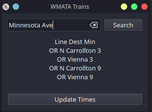
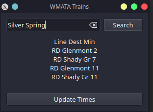
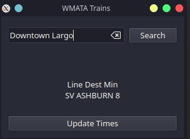

# What is this?
A simple widget for KDE-Plasma that makes a direct API call to the WMATA servers and pulls the next few trains coming for that station.

### Features Being Implemented

 - ~~Built in Search engine for train stations~~
 - ~~List-like information vs in one single line~~
 - Colored icons for train lines - WIP

> Status - It works, just not as expected

you can search the names of the train stations in the search bar, though they have to be exact.

## ---- Screenshots ----

